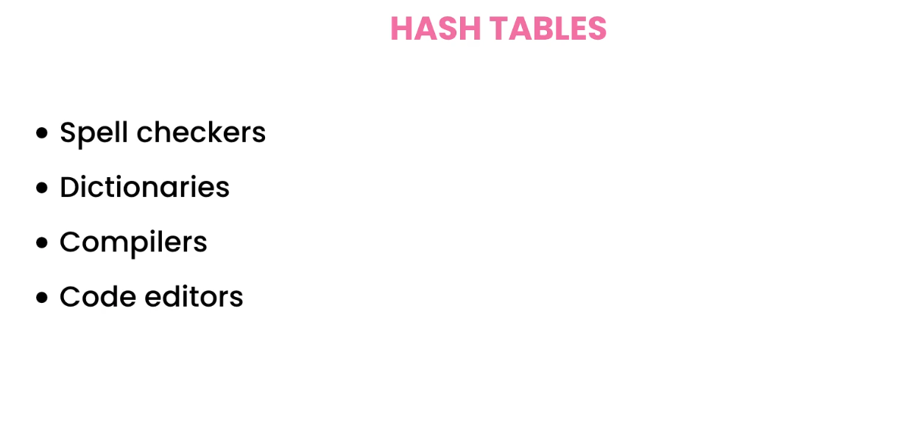
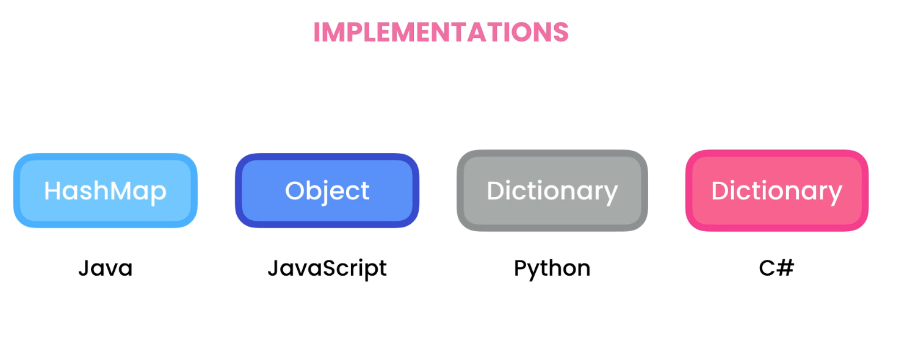
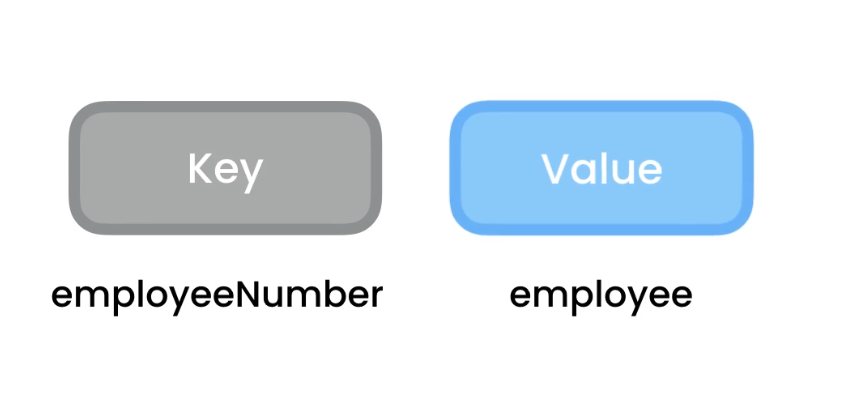
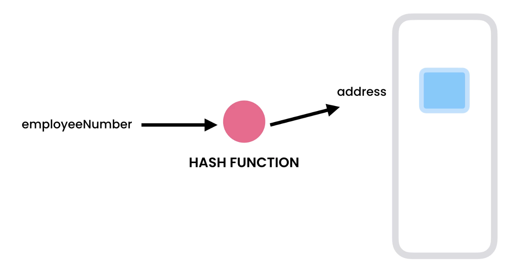
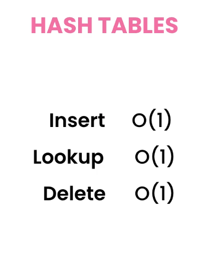

# Hash Tables

- It worls as key value

- hash function will take the key and give the memmory address which can be used to store or look up data.

- as the hash function returns same value..

## hash functions
 - a function that takes a value and maps it to different kind of value which we call a hash value/hash hode / hash / digest . 
 -  

