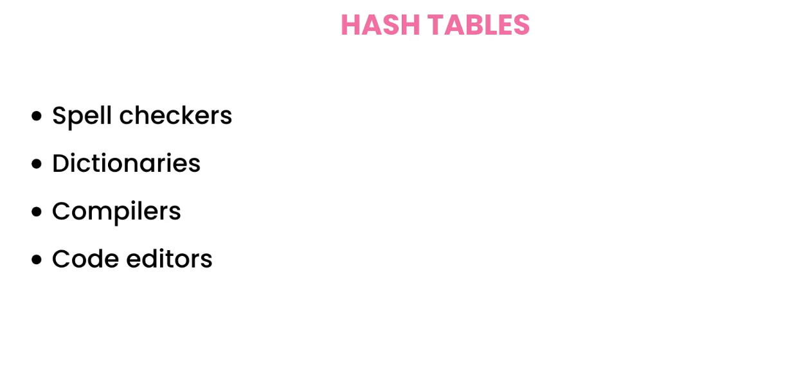
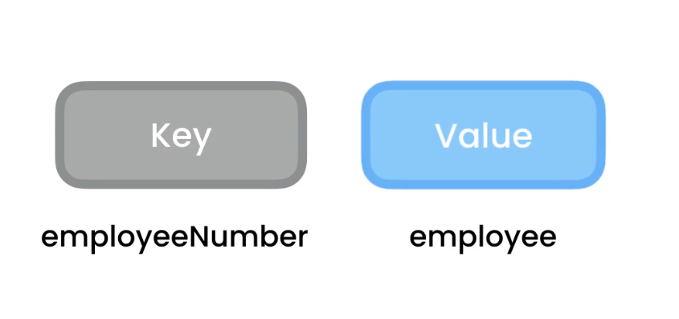
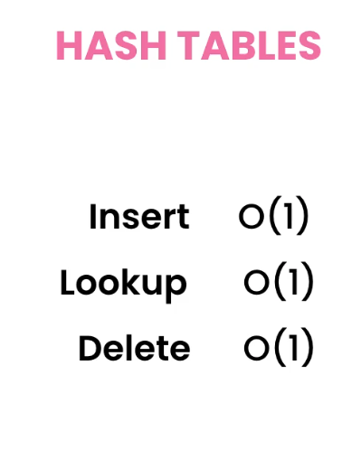
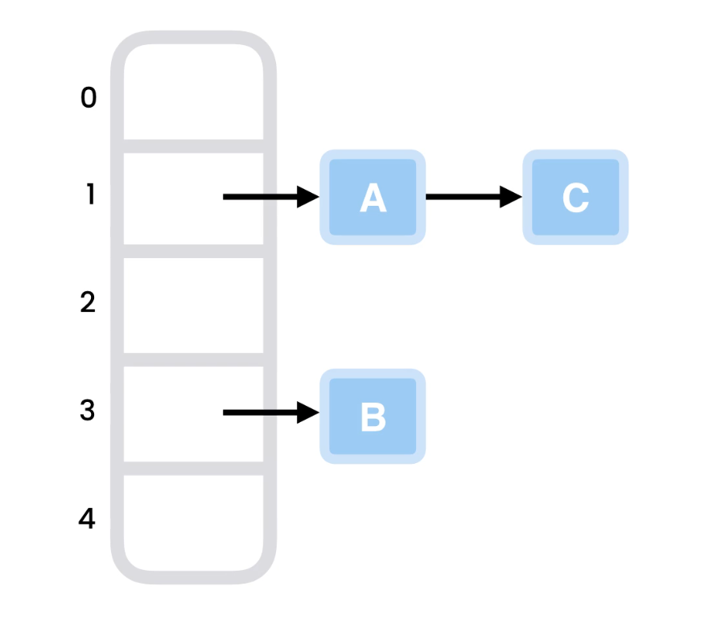
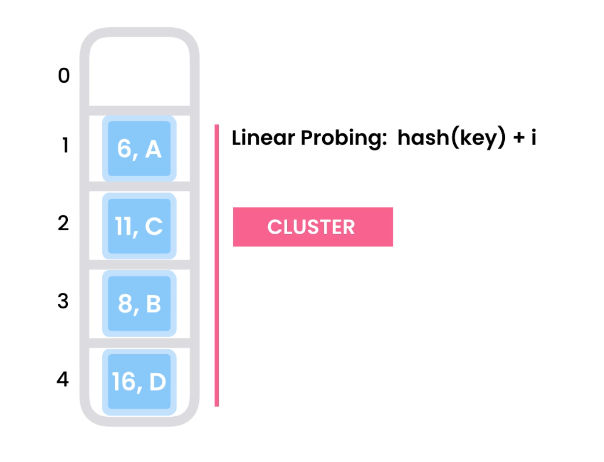
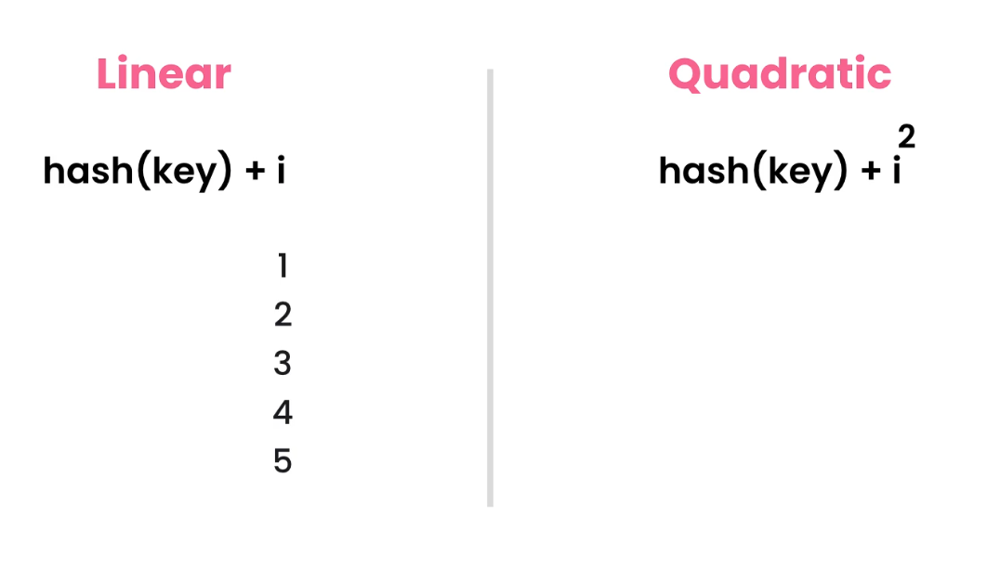
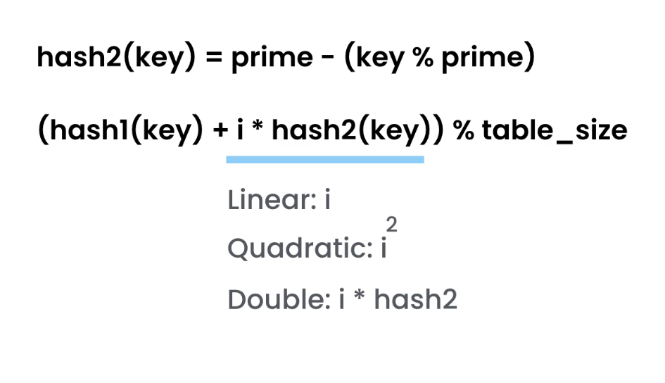
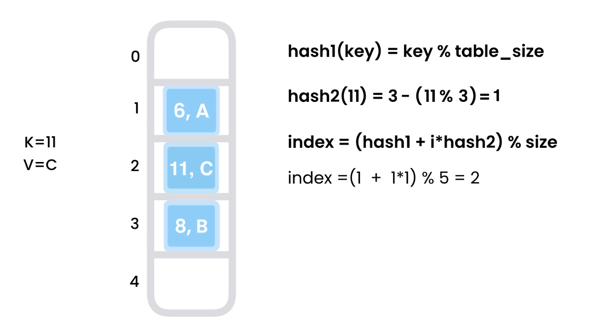
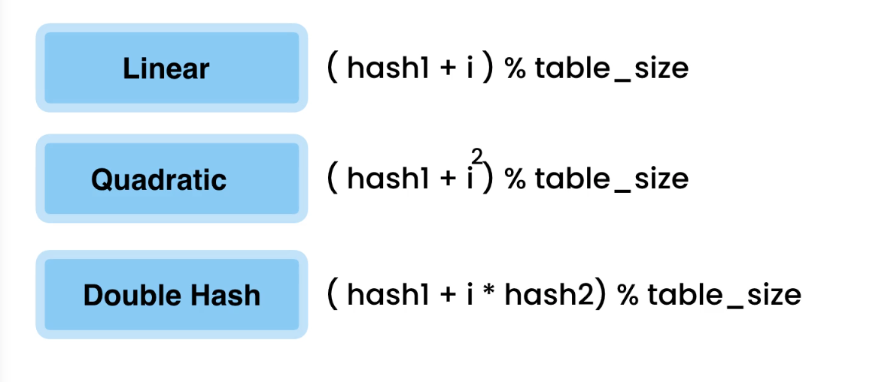

# Hash Tables

- It worls as key value

- hash function will take the key and give the memmory address which can be used to store or look up data.

- as the hash function returns same value..

## hash functions
 - a function that takes a value and maps it to different kind of value which we call a hash value/hash hode / hash / digest . 

### collision
- sometime two distinc key may result in same hash value ,,,
- we can handle a collision by **chaining** or **open addressing**
- chaining => i.e using linked list . just add up a list if it collided
- open addressing => simply finding new address to store the value . we have some algortithms to do so 

## handeling Collisions
### chaining
- use linked list so items can be added up in collision
- can be flexible because linked list easy to add and slots are just refrencing the linked list
- 
### open addressing - linear probing
- storing value in slots to corresponding hash 
- in collision , search for next empty slot until you find one . if slots get full , we cant add more 
- it form cluster which makes future probing slower
- 
### open addressing - quadratic probing
- search for open slots in different places . which may help reduce clusters 
- sometime we may make infinite loop searching for empty slot ?

### open addressing - double hashing

- if the first hash isfull, we doing i times second hash value
- on larger slots , it rarely forms cluster beacuse it jumps good
- 

### coclusion - collision algorithms 
- we start with initial value and do some different steps to find a new slot

