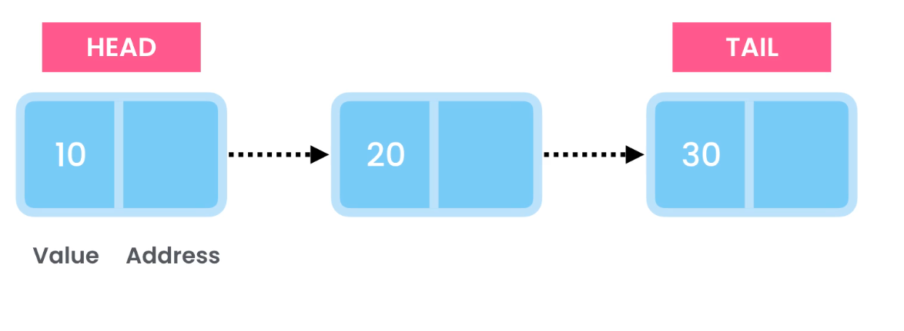
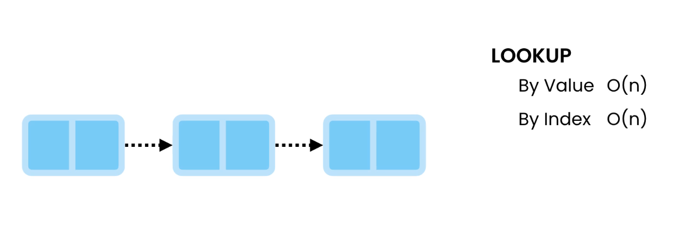
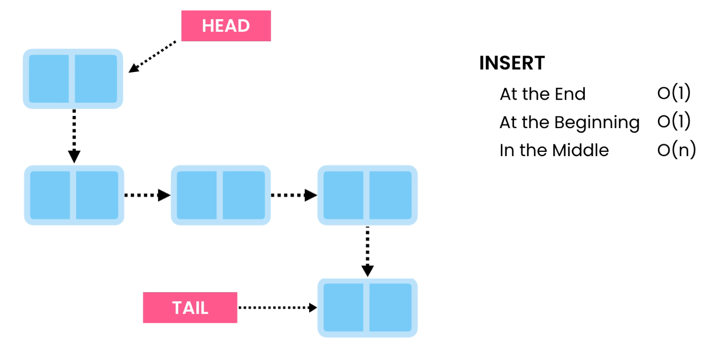
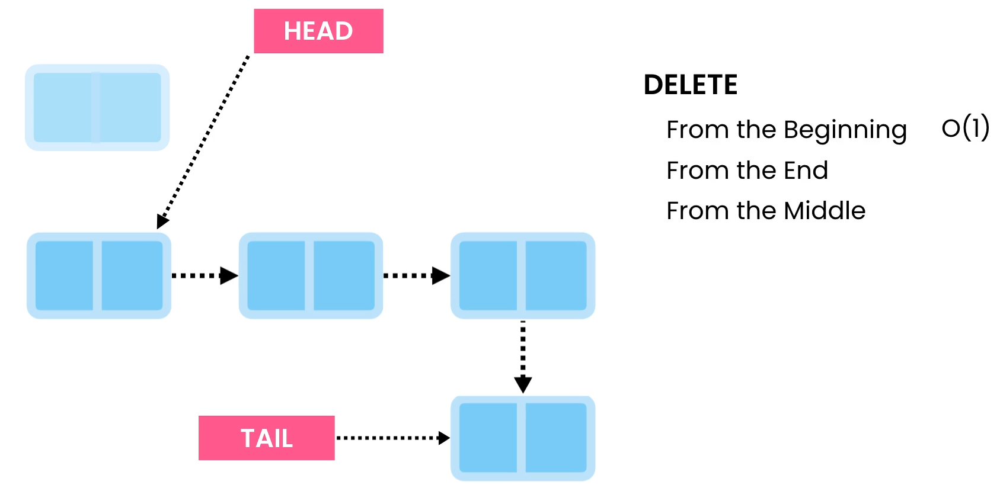
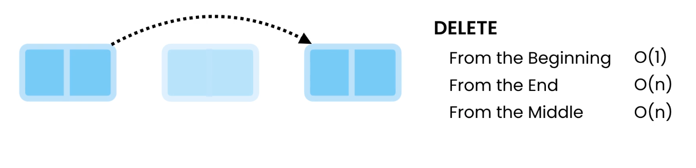
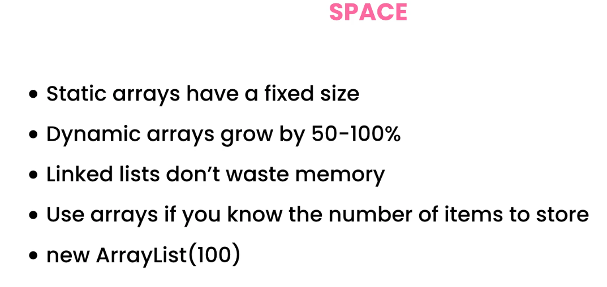
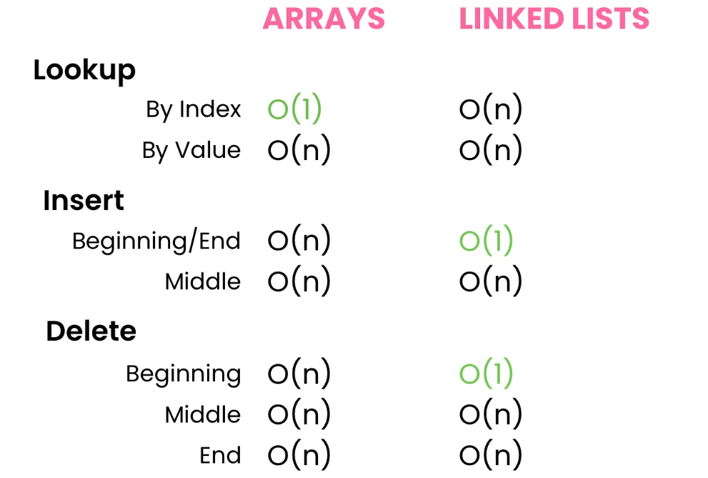
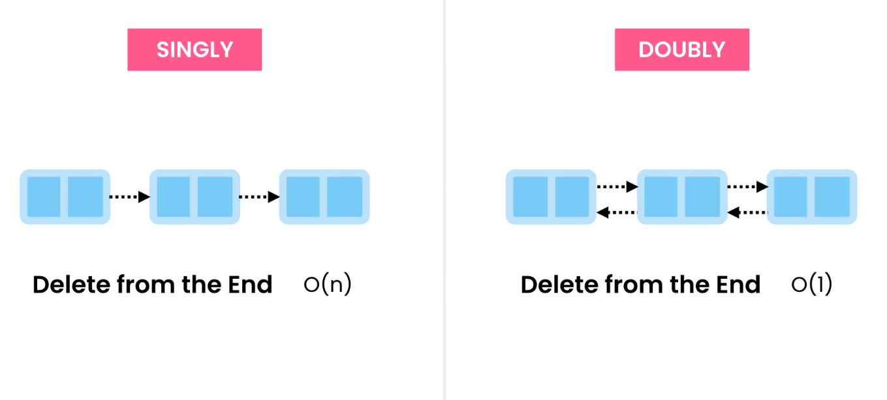
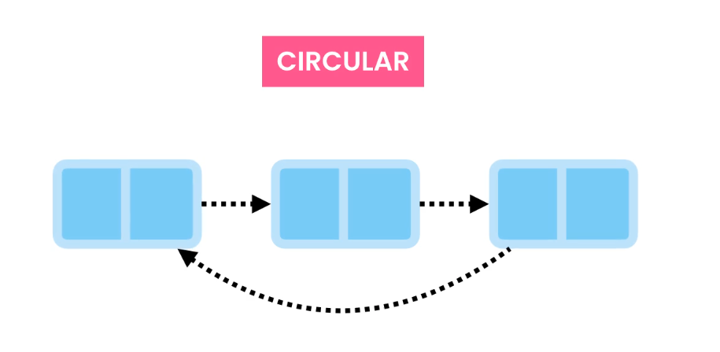

# linked List 

### lookup

 - cannot look up like in array index style . can be all over memmory as it just has a value and a pointer to next value
 - fast to look 

### insert

- cannot jump in the middle index like in array!!
- we need to follow through the links(i.e pointers)

### delete

- O(1)
- begining => move the head to second node and delete the ponter of fist node

- O(n)
- last => need to go through the link to find second last node , detach it from last node and make it tail.

- O(n)
- middle => need to go throuth the link . find the one to delete , point one before to one next , then the middle one will be removed 

## Array vs LinkedList

## Types of linked List 

both can be circular
- can be used to looop songs in a playlist

