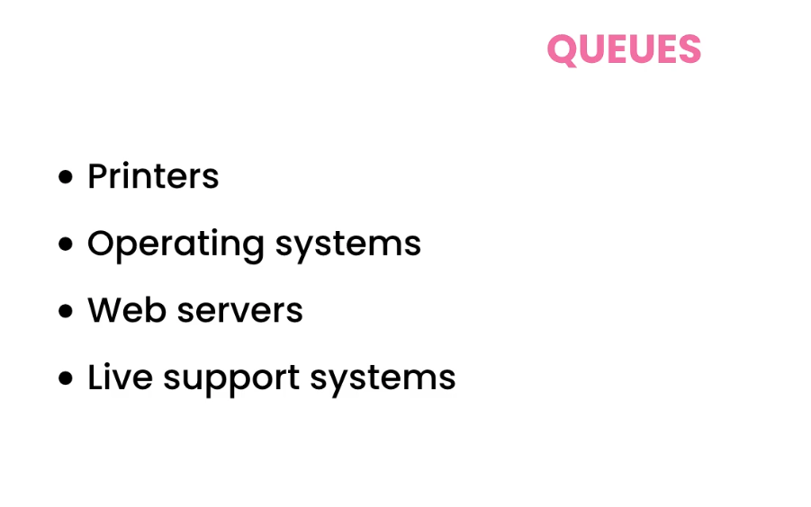
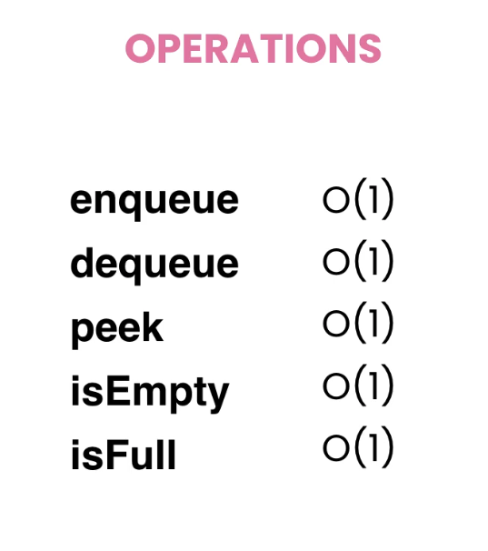
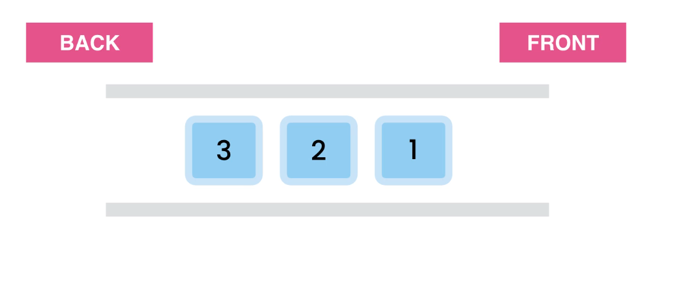

# Queues
first in first out (FIFO) principle
works like a real life waiting line 
順番待ち的な仕組み

# Priority Queues
object are processed based on priorities . Not the order added . ex => prirority mail ordering ?

